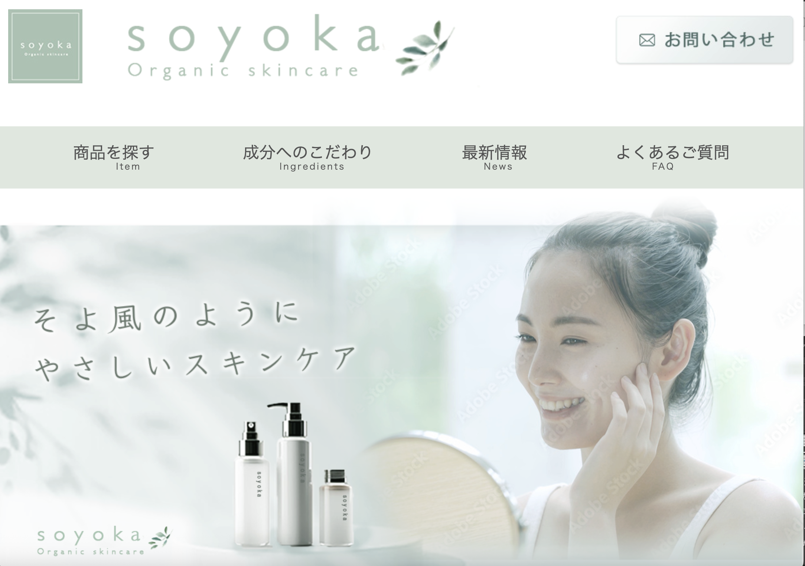

---

# 🌿 Natural Skin Care LP

忙しい毎日を送る30代女性のための  
**自然派・無添加スキンケアブランドLP（架空案件）**

## 📚 Table of Contents
- [Target Persona](#-target-persona)
- [Project Purpose](#-project-purpose)
- [Design Concept](#-design-concept)

---

## 🧑‍🦰 Target Persona

**森下 香澄（34歳）**  
宮城県仙台市在住 / 保険会社営業  

- 夫と子ども2人の4人家族
- 出産後に敏感肌へ変化
- 仕事と育児の両立でストレス過多
- 「せめて肌だけはきれいでいたい」と願っている

---

## 🎯 Project Purpose

- 敏感肌でも安心して使えるブランドイメージの確立
- 自然・無添加・やさしさを伝える世界観設計
- スマホユーザーを想定したCV導線設計

---

## 🎨 Design Concept

### 🌿 Color
ベージュ・くすみグリーンを基調に  
「安心感」「自然」「癒し」を表現。

### ✨ Layout
余白を広く取り、  
忙しい日常の中でも“呼吸できる”印象を設計。

### 📱 Responsive
スマートフォン閲覧を想定し  
3スクロール以内にCTAを配置。

---

## 🛠 Skills / Tools

- HTML
- CSS
- JavaScript
- slick.js
- レスポンシブ対応

---

## 🔗 Live Site

👉 https://mizir0.github.io/soyoka/

---

## 📌 Source Code

👉 https://github.com/mizir0/soyoka

---

## 🚀 Future Improvements

- レビューセクション強化
- CTA文言のABテスト設計
- アクセシビリティ改善
